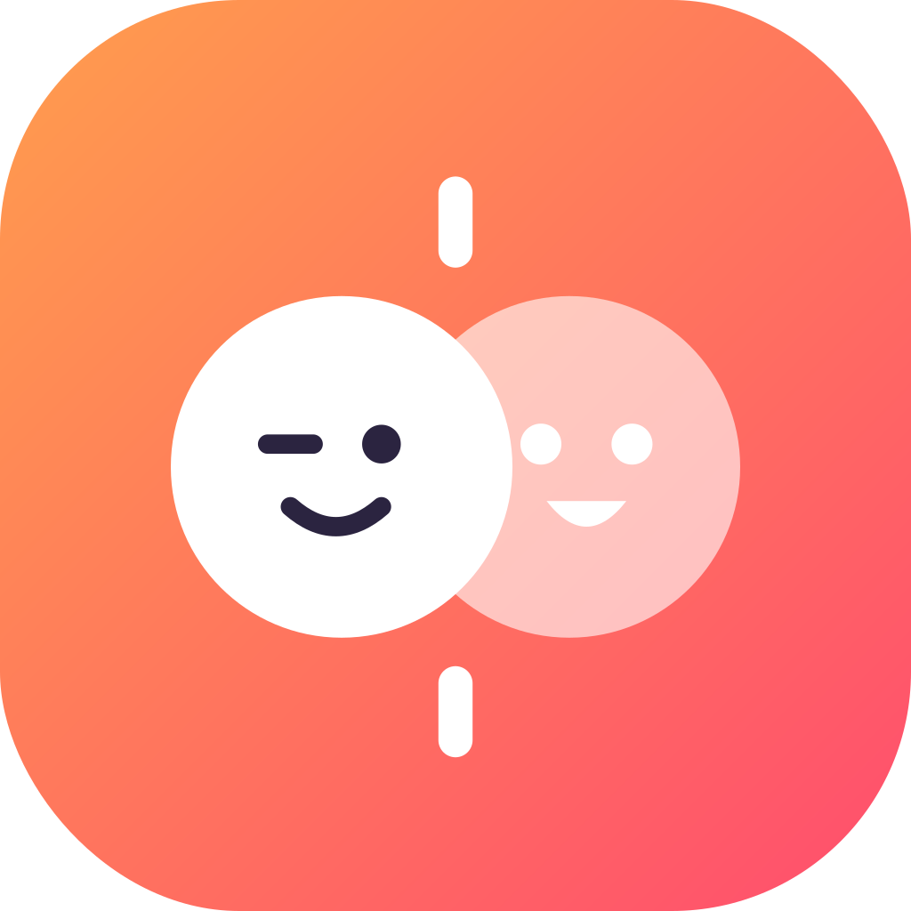

<div align="center">



# Click

**A swipe-to-meet social app for iOS.**

[](https://github.com/Musta3hmed/click-app/actions/workflows/build.yml)
[](https://github.com/Musta3hmed/click-app/releases)
[](https://github.com/Musta3hmed/click-app/commits)


[Features](#features) · [Releases](https://github.com/Musta3hmed/click-app/releases) · [Changelog](CHANGELOG.md) · [Building](#building) · [Structure](#project-structure) · [Workflow](#branch--ci-workflow) · [Android](#android-version)

</div>

---

Click is local-first with seeded demo content — **there is no backend yet**. Sign-in, profiles, chats, boosts and purchases are all simulated on-device, and every surface that simulates a paid or networked feature says so honestly in its own copy.

## Features

- **Swipe deck** — drag to like/pass with velocity-carrying fly-off, photo paging, rewind, filters (age / verified / interests), and VoiceOver like/pass actions.
- **Messaging** — opener composer (message = like + conversation), super likes with accept/deny requests, guardrailed bulk message, zoom transition into chats.
- **Boost** — a 30-minute visibility window with a live countdown, affecting match rate and profile views.
- **Chats folders** — messages, requests, profile views, and matches (every mutual like lands somewhere visible).
- **Profile & economy** — daily bingo (odds published in-app), daily reward streak, coin wallet, boosters, referral codes, edit profile.
- **Design system** — every colour, font, metric and animation curve is a `Theme` token; a five-tier motion system (`Theme.Motion` + `ClickMotion`) is enforced by CI lint; full dark theme with a light/dark/system switch; MeshGradient ambient backgrounds.
- **Safety** — report/block from every surface, hard 18+ gate, account deletion with full erasure, reduced location accuracy.

## Releases

Every phase ships as a numbered version on the [releases page](https://github.com/Musta3hmed/click-app/releases), with what changed in each. The full history also lives in [CHANGELOG.md](CHANGELOG.md).

| Version | Phase | Highlights |
|---|---|---|
| [v0.4.0-beta.1](https://github.com/Musta3hmed/click-app/releases/tag/v0.4.0-beta.1) | Phase 4 ([PR #4](https://github.com/Musta3hmed/click-app/pull/4), open) | Motion system, dark theme, boost / super like / bulk message |
| [v0.3.0](https://github.com/Musta3hmed/click-app/releases/tag/v0.3.0) | Phase 3 ([PR #3](https://github.com/Musta3hmed/click-app/pull/3)) | Ship blockers, daily bingo, emoji ban, a11y pass |
| [v0.2.0](https://github.com/Musta3hmed/click-app/releases/tag/v0.2.0) | Phase 2 ([PR #2](https://github.com/Musta3hmed/click-app/pull/2)) | Auth architecture, onboarding, swipe overhaul |
| [v0.1.0](https://github.com/Musta3hmed/click-app/releases/tag/v0.1.0) | Phase 1 ([PR #1](https://github.com/Musta3hmed/click-app/pull/1)) | Rename to Click, logo, animated welcome |

## Building

Requires Xcode 16+ with an iOS 18 SDK.

```bash
xcodebuild build-for-testing \
  -project Click.xcodeproj -scheme Click \
  -destination 'generic/platform=iOS Simulator' \
  CODE_SIGNING_ALLOWED=NO
```

CI builds every push on a macOS runner and enforces four gates: the build itself, the unit test suite, the emoji ban, and the motion-curve lint (no animation curve outside `Theme.Motion` / `ClickMotion`).

## Project structure

```
Click/
  ClickApp.swift       app entry: appearance, auth session, root routing
  Auth/                Keychain session, Apple/Google providers (mocked
                       until real credentials exist), account erasure
  Models/              SwiftData @Model types, enums (every new stored
                       property carries a declared default - migration safety)
  Screens/             Welcome, Onboarding, Swipe, Chats, Conversation,
                       Profile, Settings, Bingo, ...
  Components/          TexturedHeader, OverlappingSheet, FloatingTabBar,
                       CoinView, StickerAvatar, AmbientBackground, ...
  Support/             Theme.swift (ALL design tokens), ClickMotion,
                       ClickButtonStyle, ChromeState, Haptics, SafetyCenter
ClickTests/            unit suite (runs in CI)
ClickUITests/          UI + safety-menu regression tests (manual, need a Mac)
```

## Branch & CI workflow

- **Branch per feature, never commit to `main`** — work lands through PRs: `main` ← `next-phase` ← `phase-3` ← `phase-4`.
- Conventions (enforced or reviewed): no emoji in Swift sources; all tokens from `Theme`; Click-drawn text is lowercase, system dialogs are sentence case; honest copy only — no claims about backends that don't exist.
- See [CLAUDE.md](CLAUDE.md) for the full contributor rules.

## Android version

Click has a Jetpack Compose twin at [slayfoids/click-android](https://github.com/slayfoids/click-android) (private — ask for access). Every feature lands on both platforms; the iOS repo is the design source of truth.
